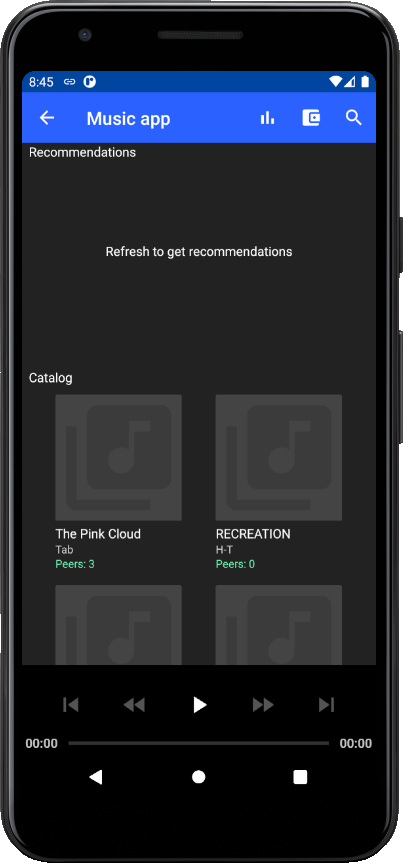

# Federated machine learning module for nusic recommendations

This repository contains a collection of Online models built on top of [IPv8](https://github.com/MattSkala/kotlin-ipv8)

**First Time Launch Screens**

Every time a user open music dao, they are asked to realod the page in order to get recommendations. This is done with the sole purpose of getting recommendations on request and avoid recommending meaningless data when there is a lack of local songs (training data).
 

**Recommendations**

 
  

Recommender community yields 2 recommendations made by 2 different models. In general, federated nachine learning library has 2 types of model: feature-based models and collaborative filtering models, so recommendations are given one per each model type.
Collaborative filtering models include 1 model so far: a Matrix Factorization Model from [this paper](https://dmle.iais.fraunhofer.de/papers/hegedus2019decentralized.pdf)
Feature-based models include 2 models from the [following paper](https://arxiv.org/pdf/1109.1396.pdf): Adaline and Pegasos.
In addition, [Essentia library](https://essentia.upf.edu/) is incorporated in this library so that around 225 distict music features can be extracted from songs and used as training data.

All peers in the network have their own local model instances for both model types. On top of that, peers gossip models and features around the network.
Local (Essentia) features are gossiped among peers in order to have features for recommendations ('unseen' songs). As a 'backup' features, trustchain transaction data as song year or genere are used (if exist).
Models do random walk around the network and at each peer they are merged and re-trained on peer's local data.
